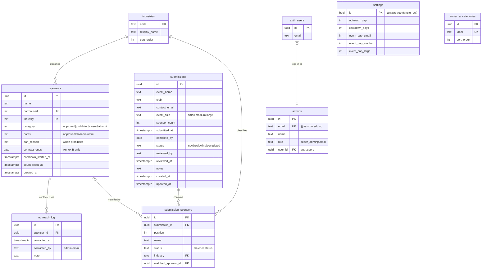

# BIZCOM SponsorCheck — Database Guide

> **What this document is.** A complete, self-contained reference to the
> SponsorCheck database (built on Supabase / PostgreSQL): the entity-relationship
> diagram, every table and foreign key, the business rules, and how each app
> screen uses the data. It is written to stand alone — you do **not** need the
> source code to understand it.
>
> **If you're a Claude chat reading this:** the human is a visual learner and
> wants you to turn this into a polished, easy-to-navigate reference document
> (diagrams, tables, plain-English explanations of the relationships and flows).
> Everything you need is below.

---

## 1. What the app does

**SponsorCheck** is an internal tool for **SMU BIZCOM** (the student body that
manages corporate sponsorships). It answers one core question for student clubs:

> *"Can we approach this company for sponsorship — or is it prohibited, on cooldown,
> alumni-owned, or something we need to vet?"*

There are **two surfaces**:

| Surface | Who uses it | What they do |
| ------- | ----------- | ------------ |
| **Public site** | Any SMU student / club | Browse the sponsor directory, upload a CSV of prospective sponsors, and get each one auto-checked against the approved list. Then email the annotated list to BIZCOM. |
| **Admin console** | BIZCOM EXCO (the committee) | Maintain the approved sponsor list, vet incoming lists, log outreach, track club submissions, and manage settings + team. |

The database is the single source of truth behind both.

---

## 2. Core concepts (the business rules)

Understanding five concepts explains almost the entire schema.

### 2.1 Sponsor categories
Every company in the system has exactly one **category** (its vetting status):

| Category | Meaning |
| -------- | ------- |
| `approved` | **Approved.** On the approved list, previously cleared by BIZCOM. |
| `prohibited` | **Prohibited.** Must not be approached (see the prohibition model below). |
| `closed` | Company has ceased operations / brand discontinued. |
| `alumni` | Alumni-affiliated — needs OAR (alumni office) clearance before outreach. |

### 2.2 The prohibition model (Annex A vs Annex B) — one table, no duplication
The SMUSA *Sponsorship Standing Order* has two annexes of prohibited sponsors.
**Both are modelled as ordinary `prohibited` sponsor rows** — there is deliberately
**no separate "annex companies" table**. Two fields carry the nuance:

- **`ban_reason`** (free text) — *why* it's prohibited, referencing the annex, e.g.
  `"Annex A, Gaming & Betting"`, `"Annex A, Board of Trustees"`,
  `"Annex B, BIZCOM partner"`, `"Annex B, Banks & Financial"`.
- **`contract_ends`** (date, nullable) — set **only** for time-boxed **BIZCOM
  partners** (Annex B). `NULL` = permanently prohibited.

The **single rule** for "is this company prohibited *right now*?", used everywhere:

```
category = 'prohibited' AND (contract_ends IS NULL OR contract_ends >= current_date)
```

So a BIZCOM partner is prohibited while its contract runs, then **automatically**
drops out of the active prohibited set the day the contract lapses.

> The Standing Order's Annex A also lists *prohibited category types* (Alcohol,
> Tobacco, Foundations, Gaming, …). Those aren't companies, so they live in their
> own small reference table, **`annex_a_categories`**.

### 2.3 Outreach cap + cooldown
BIZCOM limits how often any one company is approached, so the same brands aren't
spammed across events.

- Each logged outreach adds **+1** to a company's running count.
- When the count reaches the **`outreach_cap`** (default 10), the company enters
  a **cooldown** of **`cooldown_days`** (default 30).
- While in cooldown the company **cannot** be approached.
- When the cooldown elapses, the count **resets to 0** and the company reopens.

This is a small **state machine** per sponsor:

```
 count < cap ─────(log outreach)────▶ count + 1
      ▲                                   │
      │                          count reaches cap
      │                                   ▼
      └──(cooldown_days pass, reset)── IN COOLDOWN (prohibited)
```

The count is **derived from an append-only log** (`outreach_log`), not stored as
a mutable integer — so there's a full history of who was contacted and when.

### 2.4 Event sponsor caps
An event may only approach so many sponsors, by size. These are global settings:

| Event size | Default cap (max sponsors) |
| ---------- | -------------------------- |
| `small`    | 300 |
| `medium`   | 600 |
| `large`    | 1000 |

The public checker refuses a CSV that exceeds the cap for the chosen size.

### 2.5 Admin roles
| Role | Can do |
| ---- | ------ |
| `admin` | Everything day-to-day: manage sponsors, vet lists, log outreach, manage submissions. |
| `super_admin` | All of the above **plus** manage the team (invite/remove admins), change settings, and hard-delete. **Exactly one** super-admin exists at a time; the seat is moved with a "transfer" action. |

---

## 3. The matcher (how a company gets a status)

When a CSV is checked (public checker or admin vetting), each row is matched
against the `sponsors` table and assigned one of these **result statuses**. These
are also the allowed values of `submission_sponsors.status`:

| Status | Means |
| ------ | ----- |
| `clear` | On the approved list, comfortably below the outreach cap. Good to go. |
| `caution` | On the approved list but **approaching** the cap (within 2, e.g. 8–9 of 10). |
| `cooldown` | On the approved list but the cap is reached — in its cooldown window. |
| `alumni` | Alumni-affiliated — needs OAR clearance. |
| `prohibited` | Prohibited (Annex A/B) **or** closed. Do not approach. |
| `unverified` | Not on any list — a new company BIZCOM hasn't vetted yet. |
| `duplicate` | The same company appears more than once in the uploaded list. |

Matching is done by **normalising** names (lower-case, strip legal suffixes like
`Pte Ltd`/`LLP`/`Corp`, drop parenthesised locales, `&` → `and`) and comparing
against `sponsors.normalised` — with a trigram (`pg_trgm`) fuzzy fallback for
near-misses.

---

## 4. Entity-Relationship Diagram



> `auth_users` is Supabase's built-in **`auth.users`** table (the login
> accounts). `settings` and `annex_a_categories` have no foreign
> keys — they stand alone.

---

## 5. Foreign keys at a glance

| From (child) | Column | To (parent) | On delete | Nullable? | Why |
| ------------ | ------ | ----------- | --------- | --------- | --- |
| `sponsors` | `industry` | `industries.code` | — | No | Every company has an industry. |
| `outreach_log` | `sponsor_id` | `sponsors.id` | **CASCADE** | No | Contacts belong to a sponsor; delete the sponsor, delete its log. |
| `submissions` | *(none)* | — | — | — | Admin-managed; no FK. |
| `submission_sponsors` | `submission_id` | `submissions.id` | **CASCADE** | No | Line items belong to a submission. |
| `submission_sponsors` | `industry` | `industries.code` | — | Yes | Suggested/known industry (may be unknown). |
| `submission_sponsors` | `matched_sponsor_id` | `sponsors.id` | **SET NULL** | Yes | Links a line to the master record it matched (if any). |
| `admins` | `user_id` | `auth.users.id` | **SET NULL** | Yes | Links the whitelist row to the actual login account. |

**Not foreign keys (intentionally):** `outreach_log.contacted_by` and
`submissions.reviewed_by` store an **email string**,
not an FK to `admins` — so history survives even if an admin is later removed.

---

## 6. Table reference

### `industries` — the 15 canonical categories
Reference/lookup table. Read by everyone; written by admins.

| Column | Type | Notes |
| ------ | ---- | ----- |
| `code` | text | **PK.** Machine code, e.g. `food_beverage`. |
| `display_name` | text | Human label, e.g. "Food & Beverage". |
| `sort_order` | int | Display order. |

### `sponsors` — every company (the approved list)
The heart of the system. Holds approved, prohibited, closed, and alumni companies.

| Column | Type | Notes |
| ------ | ---- | ----- |
| `id` | uuid | **PK.** |
| `name` | text | Display name. |
| `normalised` | text | **Unique.** Lookup key for matching (lower-cased, suffix-stripped). Supplied by the app. |
| `industry` | text | **FK → industries.code.** |
| `category` | text | `approved` \| `prohibited` \| `closed` \| `alumni`. |
| `notes` | text | General notes (used by `approved`, `closed`, and `alumni`). Default `''`. |
| `ban_reason` | text | **Required when `prohibited`.** Annex reference. |
| `contract_ends` | date | Set only for Annex B BIZCOM partners; `NULL` = permanently prohibited. |
| `cooldown_started_at` | timestamptz | Stamped when the outreach cap is hit. |
| `count_reset_at` | timestamptz | Marks the start of the current outreach cycle. |
| `created_at` | timestamptz | Row creation timestamp. |

**Constraints:** `prohibited` ⇒ `ban_reason` present; `contract_ends` only allowed
when `prohibited`. (Alumni companies have no required extra field — an optional
`notes` entry is all.)

### `outreach_log` — append-only contact history
One row per logged outreach. The running count is derived from this.

| Column | Type | Notes |
| ------ | ---- | ----- |
| `id` | uuid | **PK.** |
| `sponsor_id` | uuid | **FK → sponsors.id** (cascade delete). |
| `contacted_at` | timestamptz | When. Default `now()`. |
| `contacted_by` | text | Admin email (not an FK). |
| `note` | text | Optional. |

### `annex_a_categories` — prohibited *category types*
Small reference list of Annex A prohibitions that are **types, not companies**
(Alcohol, Tobacco, Foundations, Gaming & betting, Sexual products, Insurance,
Multi-level marketing, SMU Commencement sponsors). Rendered as tags on the admin
Sponsors page.

| Column | Type | Notes |
| ------ | ---- | ----- |
| `id` | uuid | **PK.** |
| `label` | text | **Unique.** e.g. "Tobacco". |
| `sort_order` | int | Display order. |

### `submissions` — a club's submitted sponsor list (admin-tracked)
Each row is one club's request, tracked by admins on a calendar. **Admin-managed
only** — the public checker emails BIZCOM rather than writing here.

| Column | Type | Notes |
| ------ | ---- | ----- |
| `id` | uuid | **PK.** |
| `event_name` | text | e.g. "Bizad Charity Run 2026". |
| `club` | text | Submitting club. |
| `contact_email` | text | Club contact. |
| `event_size` | text | `small` \| `medium` \| `large`. |
| `sponsor_count` | int | Total sponsors the club reported. |
| `submitted_at` | timestamptz | Drives the calendar bucket. |
| `complete_by` | date | Due date. |
| `status` | text | `new` \| `reviewing` \| `completed`. |
| `reviewed_by` | text | Admin email (not an FK). |
| `reviewed_at` | timestamptz | When last reviewed. |
| `notes` | text | Handover notes. |
| `created_at` / `updated_at` | timestamptz | `updated_at` auto-maintained. |

### `submission_sponsors` — line items of a submission
Each company on a submitted list plus its computed status.

| Column | Type | Notes |
| ------ | ---- | ----- |
| `id` | uuid | **PK.** |
| `submission_id` | uuid | **FK → submissions.id** (cascade). |
| `position` | int | Preserves list order. |
| `name` | text | Company name as submitted. |
| `status` | text | A matcher status (see §3). |
| `industry` | text | **FK → industries.code** (nullable). |
| `matched_sponsor_id` | uuid | **FK → sponsors.id** (set null; nullable). |

### `admins` — the EXCO whitelist + roles
Authorises who may use the admin console. Login itself is via Supabase Auth; a
person must exist **both** here and in `auth.users` (matched by email).

| Column | Type | Notes |
| ------ | ---- | ----- |
| `id` | uuid | **PK.** |
| `email` | text | **Unique.** Must end `@sa.smu.edu.sg`. |
| `name` | text | Display name. |
| `role` | text | `super_admin` \| `admin`. |
| `user_id` | uuid | **FK → auth.users.id** (set null; linked on first sign-in). |

**Constraint:** a partial unique index enforces **at most one** `super_admin`.

### `settings` — single-row global config
One row, pinned by a boolean PK. Public-readable (students see the caps).

| Column | Type | Notes |
| ------ | ---- | ----- |
| `id` | bool | **PK**, always `true` (guarantees a single row). |
| `outreach_cap` | int | Contacts before cooldown (default 10). |
| `cooldown_days` | int | Cooldown length (default 30). |
| `event_cap_small/medium/large` | int | Max sponsors per event size. |

---

## 7. View

### `sponsor_outreach` — derived cap/cooldown state
Computes each sponsor's current outreach state from `outreach_log` + `settings`.
This is what the app reads to decide `clear` / `caution` / `cooldown`.

| Column | Meaning |
| ------ | ------- |
| `sponsor_id` | The sponsor. |
| `contact_count` | Running count in the current cycle. **Reads 0 once a cooldown has elapsed** (the reset is baked into the view so it can't drift). |
| `cooldown_started_at` | When the current cooldown began (or null). |
| `in_cooldown` | `true` while `now()` is within `cooldown_days` of the stamp. |

It's public-readable but exposes **only the aggregate** — raw `outreach_log`
rows stay admin-only.

---

## 8. Functions (RPCs)

| Function | Returns | Who | What it does |
| -------- | ------- | --- | ------------ |
| `log_outreach(sponsor_id, note?)` | `'logged'` \| `'capped'` \| `'skipped'` | admin | The one place the cap rule lives on the server. Rejects contacts during an active cooldown (`skipped`), resets an elapsed cooldown, writes the `outreach_log` row, and stamps `cooldown_started_at` when the cap is reached (`capped`). **Always use this instead of inserting into `outreach_log` directly.** |
| `transfer_super_admin(target_email)` | void | super-admin | Atomically moves the single super-admin seat (demotes the current holder first, so the one-super-admin rule is never briefly violated). |
| `is_admin()` | bool | internal | True if the caller's login email is in `admins`. Used by security rules. |
| `is_super_admin()` | bool | internal | True if the caller is the super-admin. |

---

## 9. Who can touch what (Row-Level Security)

Supabase enforces access per-table. `anon` = not logged in (public site);
`admin` = a logged-in EXCO member.

| Data | Public (anon) | Admin | Super-admin only |
| ---- | ------------- | ----- | ---------------- |
| `industries`, `sponsors`, `annex_a_categories` | read | read + write | — |
| `settings` | read | read | **write** |
| `sponsor_outreach` (view) | read | read | — |
| `submissions`, `submission_sponsors` | — | full | — |
| `outreach_log` | — | full (via `log_outreach`) | — |
| `admins` | — | read | **write** |

---

## 10. How each screen uses the data (use cases)

### Public site
| Screen | Reads | Writes | Notes |
| ------ | ----- | ------ | ----- |
| Landing page | — | — | Static marketing/intro. |
| **Sponsor directory** | `industries`, `sponsors` | — | Industry cards + browseable prohibited/closed/alumni tables. |
| **Sponsor checker** | `sponsors`, `settings`, `sponsor_outreach` | — | Upload CSV → matcher assigns each company a status → results table + summary. Enforces the event cap. Then **emails** the annotated list to BIZCOM (no DB write). |
| Standing Order | — | — | Static policy reference (Annexes A/B in prose). |

### Admin console
| Screen | Reads | Writes | Notes |
| ------ | ----- | ------ | ----- |
| **Login** | `admins` (+ Supabase Auth) | — | Only whitelisted emails get in. |
| **Home** (submissions calendar) | `submissions` | `submissions` (create/edit) | Year calendar of club submissions + a "pending" list by due date. |
| **Sponsors list** | `sponsors`, `sponsor_outreach`, `annex_a_categories` | `sponsors` (delete) | Paged, searchable, filterable list. Shows a "cooldowns ending this month" alert (from `sponsor_outreach`), the **Annex A** panel (`annex_a_categories` + prohibited sponsors whose `ban_reason` = "Annex A, Board of Trustees"), and the **Annex B** panel (prohibited sponsors with a `contract_ends`, add/remove). |
| **Sponsor detail / add-edit** | `sponsors`, `sponsor_outreach` | `sponsors` (create/update/delete) | The single-company form. Sidebar shows outreach count / cap and cooldown. |
| **Vet & upload** | `sponsors`, `settings`, `sponsor_outreach` | `outreach_log` (via `log_outreach`), `sponsors` (bulk add) | Upload a CSV, vet against the DB, log outreach for approved companies, and bulk-add new companies with their category + industry. |
| **Settings** *(super-admin only)* | `admins`, `settings` | `admins` (invite/remove, `transfer_super_admin`), `settings` (update) | Team management + cap/cooldown/event-cap configuration. |

---

## 11. Quick glossary

- **BIZCOM** — the SMU student body managing corporate sponsorships (runs this tool).
- **EXCO** — the executive committee; the admins.
- **Approved list** — the approved sponsors (`category = 'approved'`).
- **Annex A / Annex B** — sections of the SMUSA Sponsorship Standing Order listing prohibited (A, permanent) and restricted (B, includes time-boxed BIZCOM partners) sponsors. Both stored as `prohibited` sponsors.
- **OAR / OA** — the alumni office; must sign off before approaching alumni-owned companies.
- **Outreach** — a logged contact with a company for sponsorship.
- **Cooldown** — the enforced waiting period after a company hits its outreach cap.
- **Normalised name** — a cleaned company name used as the matching key.
