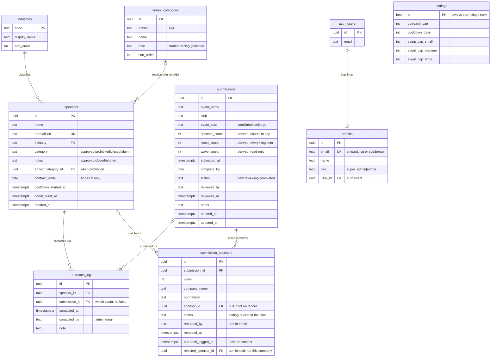

# BIZCOM SponsorCheck — Database Guide

> **What this document is.** A complete, self-contained reference to the
> SponsorCheck database (built on Supabase / PostgreSQL): the entity-relationship
> diagram, every table and foreign key, the business rules, and how each app
> screen uses the data. It is written to stand alone — you do **not** need the
> source code to understand it.
>
> **If you're a Claude chat reading this:** the human is a visual learner and
> wants you to turn this into a polished, easy-to-navigate reference document
> (diagrams, tables, plain-English explanations of the relationships and flows).
> Everything you need is below.

---

## 1. What the app does

**SponsorCheck** is an internal tool for **SMU BIZCOM** (the student body that
manages corporate sponsorships). It answers one core question for student clubs:

> *"Can we approach this company for sponsorship — or is it prohibited, on cooldown,
> alumni-owned, or something we need to vet?"*

There are **two surfaces**:

| Surface | Who uses it | What they do |
| ------- | ----------- | ------------ |
| **Public site** | Any SMU student / club | Browse the sponsor directory, upload a CSV of prospective sponsors, and get each one auto-checked against the approved list. Then email the annotated list to BIZCOM. |
| **Admin console** | BIZCOM EXCO (the committee) | Maintain the approved sponsor list, vet incoming lists, log outreach, track club submissions, and manage settings + team. |

The database is the single source of truth behind both.

---

## 2. Core concepts (the business rules)

Understanding these concepts explains almost the entire schema.

### 2.1 Sponsor categories
Every company in the system has exactly one **category** (its vetting status):

| Category | Meaning |
| -------- | ------- |
| `approved` | **Approved.** On the approved list, previously cleared by BIZCOM. |
| `prohibited` | **Prohibited.** Must not be approached (see the prohibition model below). |
| `closed` | Company has ceased operations / brand discontinued. |
| `alumni` | Alumni-affiliated — needs OAR (alumni office) clearance before outreach. |

### 2.2 The annex model (Annex A vs Annex B) — one lookup table
The SMUSA *Sponsorship Standing Order* has two annexes. **Both are modelled as
ordinary `prohibited` sponsor rows** — there is deliberately **no separate
"annex companies" table**. What separates them is a foreign key:

- **`annex_category_id`** (FK → `annex_categories.id`) — which annex category the
  company falls under. The referenced row's `annex` column (`'A'` or `'B'`) decides the
  status the checker shows.
- **`contract_ends`** (date, nullable) — set **only** for time-boxed **BIZCOM
  partners** (Annex B). `NULL` = no end date. Stays on the sponsor row because a
  contract is per-company, not per-category.

`category` stays the umbrella ("this company is on an annex"); it reads `'prohibited'`
for Annex A and Annex B alike. The two annexes mean genuinely different things to a club:

| Annex | Status shown | What the club does |
| ----- | ------------ | ------------------ |
| `A` | **Prohibited** | Cannot be approached. Remove from the list before emailing BIZCOM. |
| `B` | **Restricted** | **Keep on the list.** BIZCOM decides: an existing client is never released, while banks, telcos and statutory boards are re-vetted against the club's stated purpose. |

That last distinction lives in **`annex_categories.note`**, the student-facing guidance
string, rather than in code — so BIZCOM can reword it without a deploy.

The **single rule** for "is this company still restricted *right now*?", used everywhere:

```
category = 'prohibited' AND (contract_ends IS NULL OR contract_ends >= current_date)
```

So a BIZCOM partner is restricted while its contract runs, then **automatically** drops
out the day the contract lapses and reads as **Clear**.

> **Before migration 0017** the annex lived in a free-text `ban_reason` column, and it
> disagreed with `contract_ends` on real rows: DBS Bank and OCBC Bank read
> `"Annex B, Banks & Financial"` while carrying no contract end date, which the schema
> defined as Annex A. Two fields, one fact, no tiebreak. `ban_reason` was backfilled into
> `annex_categories` and dropped. Per-company colour belongs in `notes`.

> Pharmaceuticals and defunct companies are **not** annex categories. Pharmaceuticals
> belong to no annex, and a company that has shut down is carried by
> `category = 'closed'` and its own **Closed** status. Insurance is Annex A only.

### 2.3 Outreach cap + cooldown
BIZCOM limits how often any one company is approached, so the same brands aren't
spammed across events.

- Each logged outreach adds **+1** to a company's running count.
- When the count reaches the **`outreach_cap`** (default 10), the company enters
  a **cooldown** of **`cooldown_days`** (default 30).
- While in cooldown the company **cannot** be approached.
- When the cooldown elapses, the count **resets to 0** and the company reopens.

This is a small **state machine** per sponsor:

```
 count < cap ─────(log outreach)────▶ count + 1
      ▲                                   │
      │                          count reaches cap
      │                                   ▼
      └──(cooldown_days pass, reset)── IN COOLDOWN (prohibited)
```

The count is **derived from an append-only log** (`outreach_log`), not stored as
a mutable integer — so there's a full history of who was contacted and when.

### 2.4 Event sponsor caps
An event may only approach so many sponsors, by size. These are global settings:

| Event size | Default cap (max sponsors) |
| ---------- | -------------------------- |
| `small`    | 300 |
| `medium`   | 600 |
| `large`    | 1000 |

The public checker refuses a CSV that exceeds the cap for the chosen size.

### 2.5 Submission waves
A club rarely sends its whole sponsor list at once — it arrives in
instalments. Each instalment an admin vets against a submission is a **wave**.

- Every company vetted under a submission becomes a `submission_sponsors` row,
  written only by the `record_submission_wave()` RPC.
- A wave that records at least one new company takes the next wave number, so
  "they sent 120, then 80, then 40" survives as history.
- A company already recorded under that submission is **skipped, not
  re-counted** (unique on `submission_id` + `normalised`), so re-uploading the
  same CSV cannot inflate the total. Its **status is refreshed** though, which
  is how a lapsed cooldown or a newly-added company starts counting.
- The running total must stay within the **event cap** for the submission's
  `event_size`. A wave that would push it over is rejected outright — nothing
  is written.

### 2.6 What actually consumes the cap
The cap is *"how many sponsors this event may **approach**"* — not how many
names the club sent, and not how many were written down. A company consumes
the cap **only once outreach is logged for it** (migration 0015). Recording a
club's list is free, so a submission can hold far more companies than its cap
allows it to contact.

- `sponsor_count` — companies **contacted**. This is what the cap limits.
- `listed_count` — everything the club sent.

The table below is therefore about **eligibility**: which companies may be
contacted at all, and so may ever consume the cap.

| Vetting result | Counts towards the cap? | Why |
| -------------- | ----------------------- | --- |
| `approved` | **Yes** | Cleared and contactable. |
| `alumni` | **Yes** | Approachable once OAR has cleared them. |
| `prohibited` | No | Must not be approached at all. |
| `closed` | No | Company no longer exists. |
| `cooldown` | No | Cannot be contacted right now. Counts later if it reopens. |
| not on the database | No | Nothing is known about it yet. Recorded at zero until resolved. |

`counts_toward_cap(status)` is the single server-side definition. Every listed
company is still **stored** either way, so you keep the record of what the club
sent and why each was rejected; `listed_count` carries that raw total.

`submissions.sponsor_count` (the capped subset), `listed_count` and
`wave_count` are therefore **derived, not typed in**: a trigger recomputes them
from `submission_sponsors`, and the client has no `UPDATE` grant on any of
them, so a REST call naming one is refused rather than merely hidden by the UI.

### 2.7 One outreach per company per event
A company on a submission can be contacted **once for that event**. Logging
outreach stamps `submission_sponsors.outreach_logged_at`; a second attempt for
the same pair returns `'duplicate'` and writes nothing. A company that is not
on the submission at all returns `'not_recorded'`.

This is deliberately per-submission, not per-company: if two clubs both want
the same sponsor, those are two genuine contacts and each adds +1 to that
sponsor's global outreach count.

In the admin console this is one action per wave rather than a per-row
selection: logging covers every approved company on the wave at once, so none
can be left unticked and then locked out. A company on that wave that only
becomes approachable **later** (it was unvetted, or in cooldown) gets its own
action at that point; the ones already contacted stay locked.

A contact cannot be logged for an event the company was never recorded
against, which fixes the order of work:

1. pick the submission → 2. vet the list → 3. **record the wave** →
4. resolve the unknowns → 5. log outreach.

Note that **recording is not gated on the list being fully vetted**. The
submission should say what the club actually sent, on the day they sent it.
Unknown companies are recorded at zero and start counting once resolved and
the list is recorded again. Gating it would also be a dead end for a company
with a *possible match*: adding it to "resolve" it would duplicate the record
it already has, so confirming the match is the only correct move there.

### 2.8 Admin roles
| Role | Can do |
| ---- | ------ |
| `admin` | Everything day-to-day: manage sponsors, vet lists, log outreach, manage submissions. |
| `super_admin` | All of the above **plus** manage the team (invite/remove admins), change settings, and hard-delete. **Exactly one** super-admin exists at a time; the seat is moved with a "transfer" action. |

---

## 3. The matcher (how a company gets a status)

When a CSV is checked (public checker or admin vetting), each row is matched
against the `sponsors` table and assigned one of these **result statuses**. They
are computed in the browser by `js/lib/matcher-core.js` and shown in the results
table; no database column stores them:

| Status | Means |
| ------ | ----- |
| `clear` | On the approved list and below the outreach cap. Good to go. |
| `cooldown` | On the approved list but the cap is reached — in its cooldown window. |
| `alumni` | Alumni-affiliated — needs OAR clearance. |
| `prohibited` | Prohibited (Annex A/B) **or** closed. Do not approach. |
| `unverified` | Not on any list — a new company BIZCOM hasn't vetted yet. |
| `duplicate` | The same company appears more than once in the uploaded list. |

Matching is done by **normalising** names (lower-case, strip legal suffixes like
`Pte Ltd`/`LLP`/`Corp`, drop parenthesised locales, `&` → `and`) and comparing
against `sponsors.normalised` — with a trigram (`pg_trgm`) fuzzy fallback for
near-misses.

---

## 4. Entity-Relationship Diagram



> `auth_users` is Supabase's built-in **`auth.users`** table (the login
> accounts). `settings` has no foreign keys — it stands alone. `submissions` has none either; it is the *parent* of
> `submission_sponsors`.

---

## 5. Foreign keys at a glance

| From (child) | Column | To (parent) | On delete | Nullable? | Why |
| ------------ | ------ | ----------- | --------- | --------- | --- |
| `sponsors` | `industry` | `industries.code` | — | No | Every company has an industry. |
| `outreach_log` | `sponsor_id` | `sponsors.id` | **CASCADE** | No | Contacts belong to a sponsor; delete the sponsor, delete its log. |
| `outreach_log` | `submission_id` | `submissions.id` | **SET NULL** | Yes | Which event the contact was for. The contact itself outlives the submission. |
| `submissions` | *(none)* | — | — | — | Admin-managed; no FK. |
| `submission_sponsors` | `submission_id` | `submissions.id` | **CASCADE** | No | Line items belong to a submission; delete the submission, delete its list. |
| `submission_sponsors` | `sponsor_id` | `sponsors.id` | **SET NULL** | Yes | The record it matched, if any. Null for a company not (yet) on the database. |
| `submission_sponsors` | `rejected_sponsor_id` | `sponsors.id` | **SET NULL** | Yes | A match an admin marked "not the same company" (0022). The vetting page re-matches the row without it. |
| `admins` | `user_id` | `auth.users.id` | **SET NULL** | Yes | Links the whitelist row to the actual login account. |

**Not foreign keys (intentionally):** `outreach_log.contacted_by`,
`submissions.reviewed_by` and `submission_sponsors.recorded_by` store an
**email string**, not an FK to `admins` — so history survives even if an admin
is later removed.

---

## 6. Table reference

### `industries` — the 15 canonical categories
Reference/lookup table. Read by everyone; written by admins.

| Column | Type | Notes |
| ------ | ---- | ----- |
| `code` | text | **PK.** Machine code, e.g. `food_beverage`. |
| `display_name` | text | Human label, e.g. "Food & Beverage". |
| `sort_order` | int | Display order. |

### `sponsors` — every company (the approved list)
The heart of the system. Holds approved, prohibited, closed, and alumni companies.

| Column | Type | Notes |
| ------ | ---- | ----- |
| `id` | uuid | **PK.** |
| `name` | text | Display name. |
| `normalised` | text | **Unique.** Lookup key for matching (lower-cased, suffix-stripped). Supplied by the app. |
| `industry` | text | **FK → industries.code.** |
| `category` | text | `approved` \| `prohibited` \| `closed` \| `alumni`. |
| `notes` | text | General notes (used by `approved`, `closed`, and `alumni`). Default `''`. |
| `annex_category_id` | uuid | **FK → annex_categories.id. Required when `prohibited`.** Decides Prohibited (Annex A) vs Restricted (Annex B). |
| `contract_ends` | date | Set only for Annex B BIZCOM partners; `NULL` = no end date. A lapsed contract reads as **Clear**. |
| `cooldown_started_at` | timestamptz | Stamped when the outreach cap is hit. |
| `count_reset_at` | timestamptz | Marks the start of the current outreach cycle. |
| `created_at` | timestamptz | Row creation timestamp. |

**Constraints:** `prohibited` ⇒ `annex_category_id` present; `annex_category_id` and
`contract_ends` only allowed when `prohibited`. (Alumni companies have no required extra field — an optional
`notes` entry is all.)

### `outreach_log` — append-only contact history
One row per logged outreach. The running count is derived from this.

| Column | Type | Notes |
| ------ | ---- | ----- |
| `id` | uuid | **PK.** |
| `sponsor_id` | uuid | **FK → sponsors.id** (cascade delete). |
| `contacted_at` | timestamptz | When. Default `now()`. |
| `contacted_by` | text | Admin email (not an FK). |
| `submission_id` | uuid | **FK -> submissions.id** (set null). Which event the contact was for. Null for outreach logged outside a submission. |
| `note` | text | Optional. |

### `submissions` — a club's submitted sponsor list (admin-tracked)
Each row is one club's request, tracked by admins on a calendar. **Admin-managed
only** — the public checker emails BIZCOM rather than writing here.

| Column | Type | Notes |
| ------ | ---- | ----- |
| `id` | uuid | **PK.** |
| `event_name` | text | e.g. "Bizad Charity Run 2026". |
| `club` | text | Submitting club. |
| `event_size` | text | `small` \| `medium` \| `large`. Picks which `event_cap_*` applies. |
| `sponsor_count` | int | **Derived.** Companies on this submission with outreach logged, i.e. how many sponsors the event has actually **contacted**. This is what the cap limits. Trigger-maintained; the client has no `UPDATE` grant on the column. |
| `listed_count` | int | **Derived.** Every company the club listed, including the ones that do not consume cap. Same trigger, same lockdown. |
| `wave_count` | int | **Derived.** Highest wave number recorded. Same trigger, same lockdown. |
| `submitted_at` | timestamptz | Drives the calendar bucket. |
| `complete_by` | date | Due date. |
| `status` | text | `new` \| `reviewing` \| `completed`. |
| `reviewed_by` | text | Admin email (not an FK). |
| `reviewed_at` | timestamptz | When last reviewed. |
| `notes` | text | Handover notes. |
| `created_at` / `updated_at` | timestamptz | `updated_at` auto-maintained. |

### `submission_sponsors` — the companies vetted under a submission
One row per company, written only by `record_submission_wave()`. This is what
makes `submissions.sponsor_count` a fact rather than a claim, and what lets a
club's list arrive in several waves without losing track of the cap.

| Column | Type | Notes |
| ------ | ---- | ----- |
| `id` | uuid | **PK.** |
| `submission_id` | uuid | **FK → submissions.id** (cascade delete). |
| `wave` | int | Which instalment this company arrived in. Starts at 1. |
| `company_name` | text | As the club wrote it. |
| `normalised` | text | `Matcher.normalise(company_name)`. **Unique per submission** — that is what stops a re-uploaded list double-counting. |
| `sponsor_id` | uuid | **FK → sponsors.id** (set null). The record it matched, or null for a company not on the database. |
| `status` | text | The vetting bucket at the time (`approved`, `cooldown`, `prohibited`, `closed`, `alumni`, `review`). Deliberately **not** constrained — 0009 showed that a CHECK here just has to be chased every time the matcher's vocabulary changes. |
| `recorded_by` | text | Admin email (not an FK). |
| `recorded_at` | timestamptz | When. |
| `outreach_logged_at` | timestamptz | Set when this company is contacted **for this event**. Non-null locks it: no second outreach, and its `status` stops being refreshed by later waves. |
| `outreach_logged_by` | text | Admin email (not an FK). |

### `admins` — the EXCO whitelist + roles
Authorises who may use the admin console. Login itself is via Supabase Auth; a
person must exist **both** here and in `auth.users` (matched by email).

| Column | Type | Notes |
| ------ | ---- | ----- |
| `id` | uuid | **PK.** |
| `email` | text | **Unique.** Must be an SMU address: `@smu.edu.sg` or any subdomain (`@sa.`, `@computing.`, ...). |
| `name` | text | Display name. |
| `role` | text | `super_admin` \| `admin`. |
| `user_id` | uuid | **FK → auth.users.id** (set null; linked on first sign-in). |

**Constraint:** a partial unique index enforces **at most one** `super_admin`.

### `settings` — single-row global config
One row, pinned by a boolean PK. Public-readable (students see the caps).

| Column | Type | Notes |
| ------ | ---- | ----- |
| `id` | bool | **PK**, always `true` (guarantees a single row). |
| `outreach_cap` | int | Contacts before cooldown (default 10). |
| `cooldown_days` | int | Cooldown length (default 30). |
| `event_cap_small/medium/large` | int | Max sponsors per event size. |

---

## 7. View

### `sponsor_outreach` — derived cap/cooldown state
Computes each sponsor's current outreach state from `outreach_log` + `settings`.
This is what the app reads to decide `clear` / `cooldown`. The admin vetting
screen also uses `approaching` to flag companies nearing the cap; the public
checker deliberately does not, since a near-cap company is still contactable.

| Column | Meaning |
| ------ | ------- |
| `sponsor_id` | The sponsor. |
| `contact_count` | Running count in the current cycle. **Reads 0 once a cooldown has elapsed** (the reset is baked into the view so it can't drift). |
| `cooldown_started_at` | When the current cooldown began (or null). |
| `in_cooldown` | `true` while `now()` is within `cooldown_days` of the stamp. |

It's public-readable but exposes **only the aggregate** — raw `outreach_log`
rows stay admin-only.

---

## 8. Functions (RPCs)

| Function | Returns | Who | What it does |
| -------- | ------- | --- | ------------ |
| `log_outreach(sponsor_id, note?, submission_id?)` | `'logged'` \| `'capped'` \| `'skipped'` \| `'duplicate'` \| `'not_recorded'` \| `'not_approachable'` \| `'event_capped'` \| `'completed'` | admin | The one place **both** cap rules live. Rejects contacts during an active cooldown (`skipped`), resets an elapsed cooldown, writes the `outreach_log` row, and stamps `cooldown_started_at` when the per-sponsor cap is reached (`capped`). Given a `submission_id` it also enforces one contact per company per event (`duplicate`), refuses a company not recorded against it (`not_recorded`) or not approachable (`not_approachable`), and — since 0015 — refuses a contact that would push the event past its cap (`event_capped`). Since 0022 a completed submission answers `completed`. **Always use this instead of inserting into `outreach_log` directly.** |
| `record_submission_wave(submission_id, entries, refresh_only?)` | `{ wave, added, refreshed, skipped, counted, listed, cap, event_size }` | admin | De-dupes the payload, refreshes the status of companies already on the submission (unless they have been contacted), and inserts the new ones as the next wave. Since 0015 it does **not** check the event cap: recording is not approaching, so it cannot breach it. Since 0022: `refresh_only` updates existing rows and never inserts; entries may carry `rejected_sponsor_id`; a sponsor already on the submission is never added twice; a completed submission is refused; and the first saved wave moves a `new` submission to `reviewing`. The only way to write `submission_sponsors` — the client is granted `select` and `delete` on that table, never `insert`. |
| `counts_toward_cap(status)` | bool | internal | The single definition of which vetting results consume an event cap. |
| `recalc_submission_totals(submission_id)` | void | internal | Re-derives `submissions.sponsor_count`, `listed_count` + `wave_count`. Called by the trigger on `submission_sponsors`. |
| `transfer_super_admin(target_email)` | void | super-admin | Atomically moves the single super-admin seat (demotes the current holder first, so the one-super-admin rule is never briefly violated). |
| `is_admin()` | bool | internal | True if the caller's login email is in `admins`. Used by security rules. |
| `is_super_admin()` | bool | internal | True if the caller is the super-admin. |

---

## 9. Who can touch what (Row-Level Security)

Supabase enforces access per-table. `anon` = not logged in (public site);
`admin` = a logged-in EXCO member.

| Data | Public (anon) | Admin | Super-admin only |
| ---- | ------------- | ----- | ---------------- |
| `industries`, `sponsors` | read | read + write | — |
| `settings` | read | read | **write** |
| `sponsor_outreach` (view) | read | read | — |
| `submissions` | — | full, except the derived `sponsor_count` / `wave_count` (no column grant) | — |
| `submission_sponsors` | — | read + delete; **writes only via `record_submission_wave`** | — |
| `outreach_log` | — | full (via `log_outreach`) | — |
| `admins` | — | read | **write** |

---

## 10. How each screen uses the data (use cases)

### Public site
| Screen | Reads | Writes | Notes |
| ------ | ----- | ------ | ----- |
| Landing page | — | — | Static marketing/intro. |
| **Sponsor directory** | `industries`, `sponsors` | — | Industry cards + browseable prohibited/closed/alumni tables. |
| **Sponsor checker** | `sponsors`, `settings`, `sponsor_outreach` | — | Upload CSV → matcher assigns each company a status → results table + summary. Enforces the event cap. Then **emails** the annotated list to BIZCOM (no DB write). |
| Standing Order | — | — | Static policy reference (Annexes A/B in prose). |

### Admin console
| Screen | Reads | Writes | Notes |
| ------ | ----- | ------ | ----- |
| **Login** | `admins` (+ Supabase Auth) | — | Only whitelisted emails get in. |
| **Home** (submissions calendar) | `submissions`, `submission_sponsors` | `submissions` (create/edit, **not** the derived counts) | Year calendar of club submissions + a "pending" list by due date. Every card shows `recorded / cap` and links straight into Vet & Upload for that submission. The side panel shows the per-wave breakdown. |
| **Sponsors list** | `sponsors`, `sponsor_outreach` | `sponsors` (delete) | Paged, searchable, filterable list. Shows a "cooldowns ending this month" alert (from `sponsor_outreach`), the **Annex A** panel (sponsors whose annex category is "Board of Trustees"), and the **Annex B** panel (sponsors whose annex category sits in Annex B, add/remove). |
| **Sponsor detail / add-edit** | `sponsors`, `sponsor_outreach` | `sponsors` (create/update/delete) | The single-company form. Sidebar shows outreach count / cap and cooldown. |
| **Vet & upload** | `sponsors`, `settings`, `sponsor_outreach`, `submissions`, `submission_sponsors` | `outreach_log` (via `log_outreach`), `sponsors` (bulk add), `submission_sponsors` (via `record_submission_wave`) | Always attached to a club submission (`?submission=<id>` or the picker); step 1 is locked until one is chosen. Upload a CSV, vet against the DB, resolve unknowns by bulk-adding them, record the list as a wave against the club's cap (not gated on the list being fully vetted), resolve unknowns by bulk-adding them or confirming a possible match, then log outreach for the whole wave at once. Step 2 also works standalone as the bulk entry screen for the sponsor list, and records no outreach of its own. |
| **Settings** *(super-admin only)* | `admins`, `settings` | `admins` (invite/remove, `transfer_super_admin`), `settings` (update) | Team management + cap/cooldown/event-cap configuration. |

---

## 11. Quick glossary

- **BIZCOM** — the SMU student body managing corporate sponsorships (runs this tool).
- **EXCO** — the executive committee; the admins.
- **Approved list** — the approved sponsors (`category = 'approved'`).
- **Annex A / Annex B** — sections of the SMUSA Sponsorship Standing Order listing prohibited (A, permanent) and restricted (B, includes time-boxed BIZCOM partners) sponsors. Both stored as `prohibited` sponsors.
- **OAR / OA** — the alumni office; must sign off before approaching alumni-owned companies.
- **Outreach** — a logged contact with a company for sponsorship.
- **Cooldown** — the enforced waiting period after a company hits its outreach cap.
- **Wave** — one instalment of a club's sponsor list, vetted and recorded against its submission. Waves accumulate towards a single event cap.
- **Approachable** — a vetting result of `approved` or `alumni`. Only these consume an event's sponsor cap.
- **Normalised name** — a cleaned company name used as the matching key.
